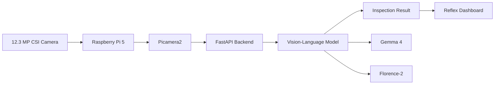
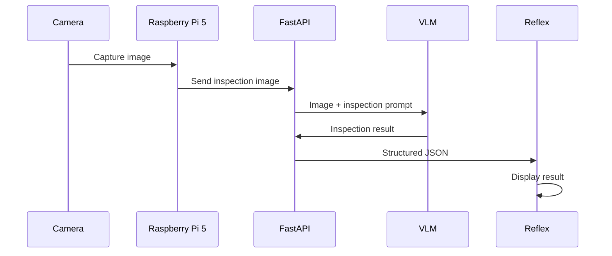

# IntelliScan

### Offline Multimodal Edge AI for Consumer Product Inspection

> **IntelliScan** is an experimental offline Edge AI system for visual inspection of consumer and agricultural products using a **Raspberry Pi 5**, high-resolution CSI camera, and multimodal Vision-Language Models (VLMs).

The project explores whether modern generative AI can perform useful visual inspection directly on resource-constrained edge hardware without relying on cloud AI services.

---

## 🚀 Overview

Traditional computer vision inspection systems often rely on dedicated object detection and classification models:

```text
Camera
   ↓
Object Detection
   ↓
Classification
   ↓
Defect Detection
   ↓
Rule Engine
```

IntelliScan explores a multimodal generative AI approach:

```text
Camera
   ↓
Raspberry Pi 5
   ↓
Image Capture
   ↓
Vision-Language Model
   ↓
Visual Reasoning
   ↓
Structured Inspection Result
```

The current system uses **Gemma 4** for multimodal inspection, while **Florence-2** and other vision-language models are being evaluated as alternative Edge AI models.

---

## ✨ Features

* 📷 High-resolution CSI camera input
* 🥧 Raspberry Pi 5 Edge AI platform
* 🧠 Multimodal Vision-Language Model inference
* 🔌 Offline/local AI processing
* ⚡ FastAPI inference backend
* 🖥️ Reflex web dashboard
* 📤 Image upload and inspection
* 🔍 External defect inspection
* 🔬 Internal condition assessment when visible
* 📝 Structured AI inspection results
* ⏱️ Inference-time monitoring
* 🔄 Model-independent architecture
* 🚧 Live camera preview and capture workflow in development

---

## 🧠 AI Inspection

IntelliScan does not simply classify an image into a predefined class.

The VLM receives an image together with an inspection prompt and generates a structured assessment.

Example:

```text
Crop: Yam

External:
Visible dark and discolored region on the surface.

Internal:
Internal tissue is not visible.

Condition:
DEFECTIVE

Defect:
Possible rot
```

The goal is to make the AI output useful for an actual inspection workflow rather than returning only a class label.

---

## 🏗️ System Architecture



### Current architecture

```text
┌──────────────────────────┐
│      CSI Camera          │
│       12.3 MP            │
└────────────┬─────────────┘
             │
             ▼
┌──────────────────────────┐
│      Raspberry Pi 5      │
│                          │
│       Picamera2          │
└────────────┬─────────────┘
             │
             ▼
┌──────────────────────────┐
│       FastAPI            │
│                          │
│  Image Inspection API    │
└────────────┬─────────────┘
             │
             ▼
┌──────────────────────────┐
│    Multimodal VLM        │
│                          │
│       Gemma 4            │
│       Florence-2         │
└────────────┬─────────────┘
             │
             ▼
┌──────────────────────────┐
│    Structured Result     │
│                          │
│  Condition               │
│  External Defect         │
│  Internal Condition      │
│  Defect Description      │
└────────────┬─────────────┘
             │
             ▼
┌──────────────────────────┐
│     Reflex Dashboard     │
└──────────────────────────┘
```

---

## 🔄 Inspection Workflow

The intended inspection workflow is:



The system is designed to analyze a **single high-quality frame** rather than continuously running the large VLM on every video frame.

This is important because multimodal generative AI inference is considerably more computationally expensive than lightweight object detection.

---

# 📷 Camera System

The camera is connected directly to the Raspberry Pi 5 using the CSI interface.

```text
12.3 MP CSI Camera
        │
        ▼
   Raspberry Pi 5
        │
        ▼
     Picamera2
```

The camera architecture supports two different image paths:

```text
                 CAMERA
                    │
          ┌─────────┴─────────┐
          │                   │
          ▼                   ▼
    Preview Stream       High Quality
                         Inspection Frame
          │                   │
          ▼                   ▼
       Reflex              VLM
                            │
                            ▼
                       AI Analysis
```

A lower-resolution stream can be used for the dashboard preview while a higher-quality frame is captured for AI inspection.

---

# 🧠 Vision-Language Models

## Gemma 4

Gemma 4 is currently being used as one of the primary multimodal inference models.

The model is being evaluated for:

* Visual understanding
* Defect recognition
* Product identification
* Natural-language inspection
* Structured reasoning
* Edge inference performance

---

## Florence-2

Florence-2 is being explored as an alternative vision model.

The objective is to compare different VLM approaches on Raspberry Pi hardware.

Evaluation areas include:

| Metric      | Description                    |
| ----------- | ------------------------------ |
| Accuracy    | Quality of visual inspection   |
| Latency     | Time required for inference    |
| RAM         | Memory consumption             |
| Model Size  | Storage requirements           |
| CPU Usage   | Edge hardware utilization      |
| Consistency | Stability of generated results |

---

# 🖥️ Frontend

The IntelliScan dashboard is built using **Reflex**.

The frontend is responsible for:

* Camera preview
* Image upload
* Image capture
* Analysis controls
* AI analysis state
* Inspection results
* System status
* Inference information

Conceptually:

```text
┌────────────────────────────────────────┐
│             VISION CAPTURE             │
│                                        │
│   ┌────────────────────────────────┐   │
│   │                                │   │
│   │       LIVE CAMERA PREVIEW      │   │
│   │                                │   │
│   └────────────────────────────────┘   │
│                                        │
│    [ Capture ] [ Upload ] [ Analyze ]  │
│                                        │
│    ● CAMERA READY                      │
└────────────────────────────────────────┘
```

During inference:

```text
┌────────────────────────────────────────┐
│             AI ANALYSIS                │
│                                        │
│        ◉ ANALYZING IMAGE...            │
│                                        │
│        Inspecting surface...           │
│        Evaluating condition...         │
│        Checking visible defects...     │
│                                        │
└────────────────────────────────────────┘
```

---

# ⚡ FastAPI Backend

FastAPI provides the local backend between the frontend, camera system, and AI model.

Current inspection endpoint:

```text
POST /api/vision/inspect
```

The endpoint:

1. Receives an image
2. Validates the uploaded file
3. Converts the image to RGB
4. Passes the image to the VLM
5. Returns a structured inspection response

Example:

```json
{
  "crop": "Yam",
  "external": "Visible dark discolored region.",
  "internal": "Internal tissue is not visible.",
  "condition": "DEFECTIVE",
  "defect": "Possible rot",
  "inference_time": 22.4,
  "device": "CPU",
  "model": "Gemma 4",
  "task": "Multimodal inspection"
}
```

---

# 📁 Project Structure

```text
IntelliScan/
│
├── assets/
│
├── intelliscan/
│   │
│   ├── components/
│   │   ├── vision_input.py
│   │   ├── analysis_panel.py
│   │   ├── activity_feed.py
│   │   ├── camera_preview.py
│   │   └── ...
│   │
│   ├── state/
│   │   └── vision_state.py
│   │
│   ├── services/
│   │   ├── api.py
│   │   ├── camera.py
│   │   └── gemma4.py
│   │
│   └── pages/
│
├── main.py
├── rxconfig.py
├── requirements.txt
└── README.md
```

---

# 🛠️ Technology Stack

| Category             | Technology              |
| -------------------- | ----------------------- |
| Edge Computer        | Raspberry Pi 5          |
| Camera               | 12.3 MP CSI Camera      |
| Camera Framework     | Picamera2               |
| Backend              | FastAPI                 |
| Frontend             | Reflex                  |
| AI                   | Gemma 4 / Florence-2    |
| Image Processing     | Pillow                  |
| Programming Language | Python                  |
| OS                   | Raspberry Pi OS / Linux |

---

# 💻 Hardware Requirements

### Minimum Hardware

* Raspberry Pi 5
* Raspberry Pi-compatible CSI camera
* microSD card / SSD
* Suitable Raspberry Pi power supply
* Active cooling

### Recommended

```text
Raspberry Pi 5
+
High-resolution CSI camera
+
Active cooling
+
Fast storage
```

AI inference can generate significant CPU and thermal load, so adequate cooling is recommended for sustained testing.

---

# ⚙️ Installation

Clone the repository:

```bash
git clone https://github.com/<your-username>/IntelliScan.git
cd IntelliScan
```

Create a virtual environment:

```bash
python3 -m venv .venv
```

Activate it:

```bash
source .venv/bin/activate
```

Install the project dependencies:

```bash
pip install -r requirements.txt
```

Depending on the selected VLM, additional model-specific dependencies may be required.

---

# ▶️ Running the Backend

Start FastAPI:

```bash
uvicorn main:app --host 0.0.0.0 --port 8000
```

Check the backend:

```text
http://<RASPBERRY-PI-IP>:8000
```

Health endpoint:

```text
http://<RASPBERRY-PI-IP>:8000/health
```

---

# ▶️ Running the Reflex Dashboard

From the project directory:

```bash
reflex run
```

The dashboard can then be opened from a browser on the local network.

---

# 🔬 Example Inspection

Input:

```text
Captured image of a yam
```

AI processing:

```text
Image
   ↓
Inspection Prompt
   ↓
Gemma 4
   ↓
Visual Reasoning
```

Output:

```text
Crop: Yam

External:
Visible abnormal discoloration on the surface.

Internal:
Not visible.

Condition:
DEFECTIVE

Defect:
Possible rot
```

The exact output depends on the image, prompt, model, and inference configuration.

---

# ⚠️ Current Limitations

This project is still under active development.

Current limitations include:

* VLM inference latency on Raspberry Pi
* CPU-only inference in the current setup
* Limited inspection dataset
* Generative model output variability
* Internal defects cannot reliably be determined from an intact external image
* Camera preview integration is still being refined
* Model optimization is ongoing
* Quantitative defect-detection accuracy has not yet been fully benchmarked

These limitations are part of the ongoing Edge AI research and development process.

---

# 📊 Performance

Initial testing has shown multimodal inference times in the range of approximately:

```text
~20–25 seconds
```

on the current Raspberry Pi setup.

Performance depends on:

* Model variant
* Image resolution
* Prompt length
* Runtime
* Quantization
* Thermal conditions
* Raspberry Pi configuration

Future benchmarks will compare models using a consistent test dataset and hardware configuration.

---

# 🧪 Model Benchmarking

The project will eventually benchmark multiple models:

```text
             ┌───────────────┐
             │ Test Dataset  │
             └───────┬───────┘
                     │
          ┌──────────┼──────────┐
          ▼          ▼          ▼
       Gemma 4   Florence-2   Other VLM
          │          │          │
          └──────────┼──────────┘
                     ▼
              Benchmarking
                     │
        ┌────────────┼────────────┐
        ▼            ▼            ▼
     Accuracy      Speed        Memory
```

The objective is to identify the best balance between:

**Accuracy ↔ Speed ↔ Memory ↔ Model Capability**

for Raspberry Pi Edge AI deployment.

---

# 🗺️ Roadmap

## Camera

* [x] Raspberry Pi CSI camera
* [ ] Picamera2 camera service
* [ ] Live camera preview
* [ ] Capture frame
* [ ] Camera status indicator

## AI

* [x] FastAPI inference endpoint
* [x] Gemma multimodal inference
* [ ] Florence-2 integration
* [ ] Model benchmarking
* [ ] Quantization
* [ ] Runtime optimization
* [ ] Hardware acceleration evaluation

## Frontend

* [x] Reflex dashboard
* [x] Image upload
* [x] Analysis state
* [ ] Improved image preview
* [ ] Animated inference state
* [ ] Live camera view
* [ ] Capture → Analyze workflow
* [ ] Inspection history

## Inspection

* [ ] Larger inspection dataset
* [ ] Defect categories
* [ ] Quantitative accuracy evaluation
* [ ] Confidence estimation
* [ ] Defect localization
* [ ] Inspection history
* [ ] Automatic inspection triggers

---

# 🔐 Offline-First Design

One of the core principles of IntelliScan is **local inference**.

The intended deployment is:

```text
                INTERNET
                   ✕
                   │
                   │
        ┌──────────▼──────────┐
        │    Raspberry Pi 5   │
        │                     │
        │  Camera             │
        │  FastAPI            │
        │  VLM                │
        │  Reflex             │
        └─────────────────────┘
```

The system is designed to perform the core inspection workflow locally without requiring an external AI API.

This makes the project particularly relevant for:

* Offline environments
* Remote deployments
* Privacy-sensitive inspection
* Low-connectivity environments
* Edge manufacturing
* Agricultural inspection
* Embedded AI research

---

# 🎯 Project Objective

The central research question behind IntelliScan is:

> **Can modern multimodal generative AI provide useful visual inspection capabilities on a low-power Edge AI platform such as the Raspberry Pi 5?**

The project investigates the trade-off between:

```text
        AI Capability
             ▲
             │
             │
Speed ◄──────┼──────► Accuracy
             │
             │
             ▼
       Edge Resources
```

Rather than optimizing for only accuracy or only inference speed, IntelliScan aims to find a practical balance suitable for real-world Edge AI deployment.

---

# 🚧 Project Status

**Status: Active Development**

### Currently working

* Raspberry Pi 5 platform
* High-resolution CSI camera
* FastAPI backend
* Reflex frontend
* Image upload
* Multimodal image inspection
* Gemma 4 experimentation
* Structured inspection results

### Currently being developed

* Picamera2 integration
* Live camera preview
* Capture-to-analysis workflow
* Florence-2 evaluation
* Inference optimization
* Model benchmarking
* Inspection dataset development

---

# 📸 Screenshots

Screenshots and demonstration videos will be added as the dashboard reaches a more stable release.

Recommended screenshots:

1. IntelliScan dashboard
2. Live camera preview
3. Image inspection screen
4. AI analysis in progress
5. Completed inspection result
6. Raspberry Pi 5 hardware setup

---

# 🤝 Contributing

IntelliScan is currently an experimental Edge AI project.

Contributions, ideas, model comparisons, optimization techniques, and hardware testing are welcome as the project evolves.

If you would like to contribute:

```bash
git fork
git clone
git checkout -b feature/my-feature
```

Submit a pull request with a description of the change and testing performed.

---

# 📄 License

License information will be added as the project moves toward public release.

---

# 👨‍💻 Author

**Kunle Olujimi**

Embedded Systems Engineer | AI Engineer | Edge AI Developer

**InnoSphere**

---

## ⭐ IntelliScan

**Offline Multimodal Edge AI for Consumer Product Inspection**

Built to explore the intersection of:

**Embedded Systems + Computer Vision + Generative AI + Edge AI**

```text
Camera
   +
Edge Hardware
   +
Multimodal AI
   +
Generative Reasoning
   =
Intelligent Local Inspection
```
